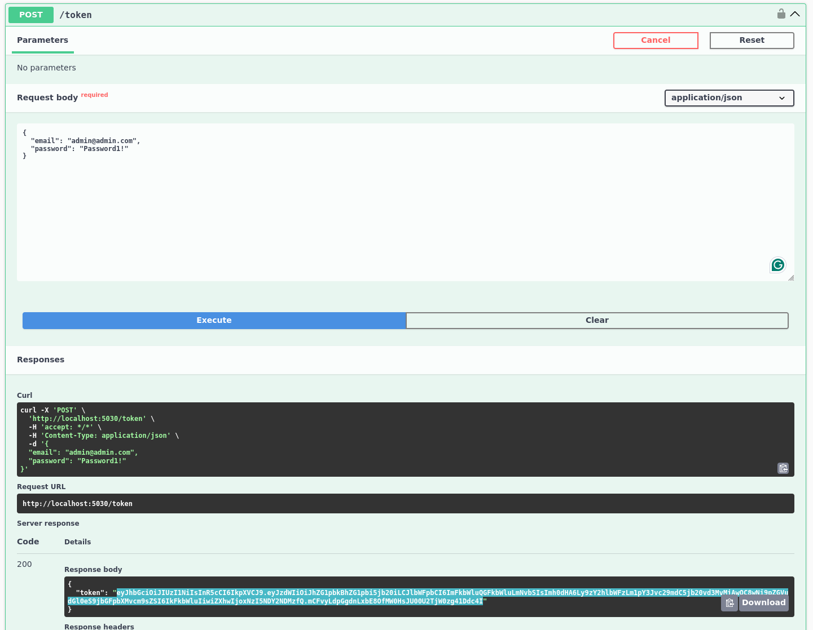
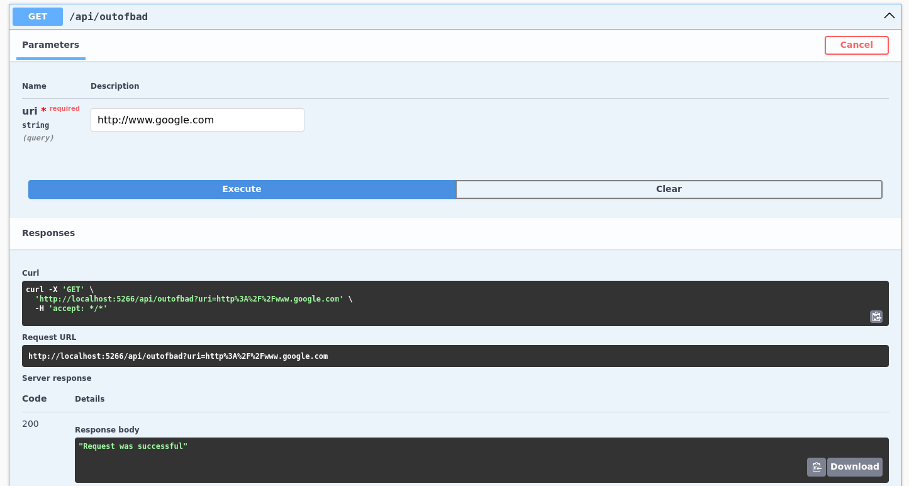
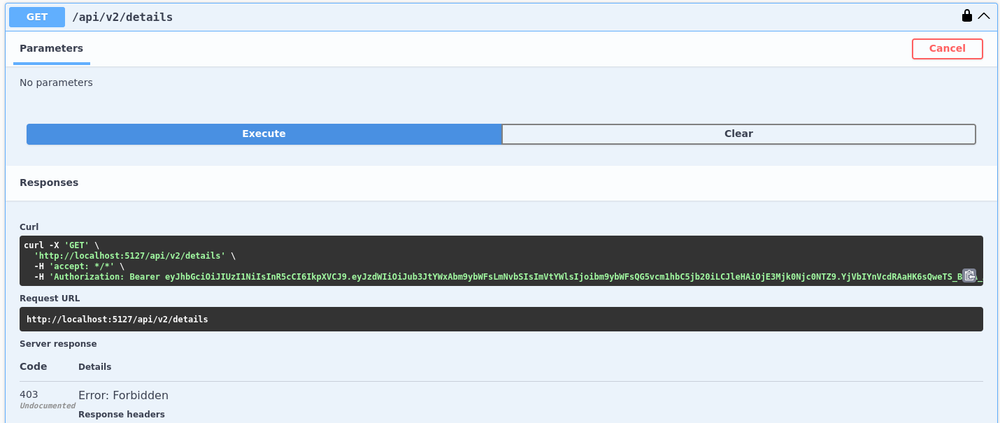

# DotSec
Common Dotnet Security Issues and Fixes, __A Note on these projects, they are mostly minimal api's designed to showcase security issues and fixes. They are not designed to be taken as architectural guides for how to structure production applications or as guidelines for how to [configure auth](https://cwe.mitre.org/data/definitions/547.html) for an application. Also note that much of this project exposes [OpenAPI Swagger pages](https://cwe.mitre.org/data/definitions/200.html) for demo and can return [detailed error pages](https://cwe.mitre.org/data/definitions/756.html), this is not something you should do in production. Some helpful links are the [OWSAP docker security cheat sheet](https://cheatsheetseries.owasp.org/cheatsheets/Docker_Security_Cheat_Sheet.html) and the [OWSAP dotnet security cheatsheet](https://cheatsheetseries.owasp.org/cheatsheets/DotNet_Security_Cheat_Sheet.html). To run these projects either run the relevant docker commands or run `dotnet run` in the project dir.__

### Build/Run Examples
<details>
<summary>Build/Run Example Details</summary>


</details>

## DockerSecurity
<details>
<summary>Docker Security Details</summary>
Two identical "Hello World" APIs, each implemented with distinct Dockerfiles. The first app, Insecure, is based on the <a href="https://learn.microsoft.com/en-us/dotnet/core/docker/build-container">default .NET template</a> and presents several security and efficiency issues; specifically <a href="https://cwe.mitre.org/data/definitions/250.html">CWE-250: Execution with Unnecessary Privileges</a>. The second app, Secure, features an improved Dockerfile that addresses these concerns.

### Highlights of Secure Dockerfile improvements

- **Alpine Images:** Utilizes Alpine-based images for a smaller build and deployment footprint, optimizing resource usage.
- **Specific SHA Tags:** Implements exact SHA image tags to enhance immutability, security, and stability against potential vulnerabilities.
- **Selective File Copying:** Only copies and builds the necessary files, reducing the overall image size and attack surface.
- **Minimal Publishing:** Publishes only the required files (DLLs), excluding unnecessary executables.
- **Non-Root User:** **Critically** creates and assigns a dedicated non-root user and group, running the container under this user to improve security.
- **Defined Port Exposure:** Explicitly exposes the specified application ports, following best practices for container configuration.
- **Docker Compose File For ReadOnly file system:** That sets the file system to read-only, run `docker-compose build` && `docker-compose up`


</details>

## Injection
<details>
<summary>Inject Details</summary>

<a href="https://cwe.mitre.org/data/definitions/89.html">CWE-89</a> SQL Injection. This project demonstrates a typical SQL injection vulnerability. Navigate to <a href="http://localhost:YOURPORT/swagger/index.html">http://localhost:YOURPORT/swagger/index.html</a> to explore two endpoints: one vulnerable to SQL injection attacks and the other designed to be resistant. Use the following payload to test each endpoint and observe the differences!

**Payload:**
```json
{
  "username": "bad' OR '1'='1",
  "password": "bad' OR '1'='1"
}
```

> **Note:** Running this project will spin up an SQLite database.


### Highlights of Secure Endpoint Improvements

- **Parameterized Queries:** 
  - When raw SQL execution is necessary and an ORM isn't available, always use parameterized queries to prevent injection. For Entity Framework Core, this can be achieved using `FromSqlRaw` with parameters or by utilizing `FromSql`, which automatically handles parameterization.

- **Hashing Passwords and Salting:** 
  - Rule #1 of Authentication & Authorization (AuthN & AuthZ) is to never implement your own authentication. If you need to store passwords and don’t have access to a robust framework like [Microsoft Identity](https://learn.microsoft.com/en-us/aspnet/core/security/authentication/identity?view=aspnetcore-8.0), ensure you store only the hash of the password along with a random salt value. This practice helps protect against dictionary attacks by preventing attackers from easily guessing passwords or common hashes. __Also make sure you have a strong password policy when you allow users to self service accounts.__ Note that while this demo's SQL injection attacks, NoSQL Injection attacks are also extremely common and implemented (and fixed) in a similar manor.


</details>

## BOLA (Broken Object Level Authorization)
<details>
<summary>BOLA Details</summary>
This project demonstrates a typical <a href="https://owasp.org/API-Security/editions/2023/en/0xa1-broken-object-level-authorization/">BOLA</a> vulnerability, which poses a significant security risk as it allows consumers to access not only their own resources but also those of others they were not intended to access. Static code analyzers often struggle to detect this issue. The project highlights related vulnerabilities such as <a href="https://cwe.mitre.org/data/definitions/285.html">CWE-285: Improper Authorization</a> and <a href="https://cwe.mitre.org/data/definitions/639.html">CWE-639: Authorization Bypass Through User-Controlled Key</a>. To explore five endpoints, navigate to <a href="http://localhost:YOURPORT/swagger/index.html">http://localhost:YOURPORT/swagger/index.html</a>.

<br>
<br>

`/api/insecure/details`
**Payload:**
```json
{
  "id": 1
}
```
This endpoint allows you to increment the id parameter to access additional user accounts. Such vulnerabilities are often missed by static analyzers, making them a significant security risk. This endpoint does not require authentication, but even if it did, the flaw could still be exploited.


`/api/dangerous/getallusers`
Retrieves a list of all user IDs for demonstration purposes.


`/api/details`
**Payload:**
```json
{
  "userId": "Some Guid From getallusers"
}
```
This endpoint attempts to mitigate the issue by using Guid values instead of easily incremented IDs, making them harder to guess. However, similar to the previous endpoint, even with authorization, an attacker could still access additional user details with sufficient effort.


`/token`
**Payload:**
```json
{
  "email": "normal@normal.com",
  "password": "Password1!"
}
```
This endpoint generates a token for authentication. The identity implementation in this project is not production-ready but serves to demonstrate how to address the BOLA vulnerability.


`/api/secure/details`
**Payload:**
```json
{
  "userId": "Some Guid From getallusers"
}
```
This endpoint requires a valid JWT token and a valid userId Guid. It critically checks the current user's email against the email of the account details being retrieved. If they do not match, a 401 Unauthorized response is returned. While this solution improves security, further enhancements could include implementing Role-Based Access Control (RBAC) and user access policies to strengthen data protection. Overall, this last approach is significantly more secure than the initial implementation.


</details>

## BOPLA (Broken Object Property Level Authorization)
<details>
<summary>BOPLA Details</summary>
This project demonstrates a typical <a href="https://owasp.org/API-Security/editions/2023/en/0xa3-broken-object-property-level-authorization/">BOPLA</a> vulnerability, where the API exposes excessive information and allows updates to unintended data; which allows for privilege escalation in a system. Like BOLA, this issue is often undetectable by static code analysis tools. The project highlights related vulnerabilities such as <a href="https://cwe.mitre.org/data/definitions/213.html">CWE-213: Exposure of Sensitive Information Due to Incompatible Policies</a> and <a href="https://cwe.mitre.org/data/definitions/915.html">CWE-915: Improperly Controlled Modification of Dynamically-Determined Object Attributes</a>. To explore five endpoints, navigate to <a href="http://localhost:YOURPORT/swagger/index.html">http://localhost:YOURPORT/swagger/index.html</a>.

<br>
<br>

`/api/insecure/details`

This endpoint returns the complete user object from the database, leading to excessive data exposure. Sensitive fields, such as "IsAdmin", may become visible to consumers. This could allow unauthorized users to attempt to elevate their privileges during user registration.


`/api/details`

This endpoint mitigates the data exposure issue by returning a tailored response object, which includes only the properties the API owner intends to expose—specifically, just the username.


`/token`
**Payload:**
Doesn't have the required Claim (will fail):
```json
{
  "email": "normal@normal.com",
  "password": "Password1!"
}
```
Has the required Claim:
```json
{
  "email": "admin@admin.com",
  "password": "Password1!"
}
```
This endpoint generates a token for authentication. The identity implementation in this project is not production-ready but serves to demonstrate how to address the BOPLA vulnerability.


`/api/secure/details`
This endpoint requires a valid JWT token with the "AdminAccess" claim. It employs policy-based authorization, ensuring that only users with the necessary claims can access it. Although this endpoint returns a dedicated response object that includes the "IsAdmin" field, it enhances security by restricting access to expected users.


`/api/update`
**Payload:**
```json
{
  "username": "Some username",
  "isAdmin": "A IsAdminFlag"
}
```
This endpoint allows for users to update their object. Note that this is an unauthorized endpoint and something we will touch on in the bfla (Broken Function level Authorization) project.

</details>

## Unrestricted Resource Consumption
<details>
<summary>Unrestricted Resource Consumption</summary>
<a href="https://owasp.org/API-Security/editions/2023/en/0xa4-unrestricted-resource-consumption//">Unrestricted Resource Consumption</a>, <a href="https://cwe.mitre.org/data/definitions/770.html">CWE-770: Allocation of Resources Without Limits or Throttling</a>, <a href="https://cwe.mitre.org/data/definitions/400.html">CWE-400: Uncontrolled Resource Consumption</a>, <a href="https://cwe.mitre.org/data/definitions/799.html">CWE-799: Improper Control of Interaction Frequency</a>, <a href="https://nvlpubs.nist.gov/nistpubs/SpecialPublications/NIST.SP.800-204.pdf">"Rate Limiting (Throttling)" - Security Strategies for Microservices-based Application Systems, NIST</a>, and <a href="https://owasp.org/API-Security/editions/2023/en/0xa6-unrestricted-access-to-sensitive-business-flows/">Unrestricted Access to Sensitive Business Flows</a>. This project demonstrates various fixes to help mitigate unrestricted resource consumption and unrestricted access to sensitive business flows, an issues often overlooked by static code analysis. To run the application, execute `docker-compose build && docker-compose up`, then navigate to <a href="http://localhost:5001/">http://localhost:5001/</a>.

### Highlights improvements to mitigate the issue

- **Rate Limiting:** The application implements `sliding window` rate limiting middleware for the endpoint. While effective for single instances, a distributed system may require a more comprehensive distributed rate limiter service, presenting an interesting system design challenge (and one of my personal favorite interview questions.) This solution in particular can help alleviate pressure from Unrestricted Access to Sensitive Business Flows when combined with some form of IP filtering/bot protection.
- **Cancellation Tokens:** The endpoint now accepts a `CancellationToken`, allowing clients to cancel requests. This token can also be used to abort downstream tasks, helping to prevent long-running processes from continuing after a client disconnects.
- **Request Timeout middleware:** New Request Timeout policies have been added to the endpoint, which automatically cancel any request exceeding a specified timeout threshold. This helps manage long-running requests that could exceed expected durations.
- **Container Resource Limits:** I created a K8s `pod.yml` and `docker-compose.yml` files that impose limits on container resources (CPU, memory, etc.). This approach helps prevent node resource exhaustion in a microservice environment where auto-scaling is implemented.


</details>

## BFLA (Broken Function Level Authorization)
<details>
<summary>BFLA Details</summary>
This project demonstrates a typical <a href="https://owasp.org/API-Security/editions/2023/en/0xa5-broken-function-level-authorization/">BFLA</a> vulnerability, where the API does not secure functions and endpoints that allow a user to execute a flow despite not having the expected privilege. Like BOLA and BOPLA, this issue is often undetectable by static code analysis tools. The project highlights related vulnerabilities such as <a href="https://cwe.mitre.org/data/definitions/285.html">CWE-285: Improper Authorization</a>. To explore three endpoints, navigate to <a href="http://localhost:YOURPORT/swagger/index.html">http://localhost:YOURPORT/swagger/index.html</a>.

<br>
<br>

`/api/insecure/delete`
**Payload:**
```json
{
  "username": "basic@basic.com",
}
```
This insecure endpoint allows the deletion of any user, making it highly dangerous.


`/api/secure/delete`
**Payload:**
```json
{
  "username": "normal@normal.com",
}
```
This endpoint mitigates the risks of the first by requiring the user to authenticate with a JWT and ensuring the user is in the "Admin" role to access it. Although it performs the same function as the insecure endpoint, it is safer as it restricts access to authenticated and authorized users. It employs Role-Based Access Control (RBAC), ensuring that only users with the necessary claims can access it. Additionally, this endpoint returns a dedicated response object that includes the "IsAdmin" field, further enhancing security by confirming user roles.


`/token`
**Payload:**
Doesn't have the required role, will fail on the secure endpoint:
```json
{
  "email": "normal@normal.com",
  "password": "Password1!"
}
```
Has the required role for the secure endpoint:
```json
{
  "email": "admin@admin.com",
  "password": "Password1!"
}
```
This endpoint generates a token for authentication. Note that the identity implementation in this project is not production-ready but serves to demonstrate how to address the BFLA vulnerability.


</details>

## SSRF (Server Side Request Forgery)
<details>
<summary>SSRF Details</summary>
This project demonstrates a typical <a href="https://owasp.org/Top10/A10_2021-Server-Side_Request_Forgery_%28SSRF%29/">SSRF</a> vulnerability, where the API fails to validate a client-provided URL before making a request. Such oversight can lead to serious consequences, including exposure of sensitive data, DDoS attacks, privilege escalation, and various other exploitations. Even if the client is developed in-house, it should not be trusted on the server side. The project illustrates both In-Band SSRF, where the results of calls are returned directly to the caller, and Out-Of-Band or Blind SSRF, where results are not directly returned. Although the latter is somewhat better than the former, a skilled attacker could still compromise your system quickly. The project highlights vulnerabilities like <a href="https://cwe.mitre.org/data/definitions/918.html">CWE-918: Server-Side Request Forgery (SSRF)</a>. To explore three endpoints, navigate to <a href="http://localhost:YOURPORT/swagger/index.html">http://localhost:YOURPORT/swagger/index.html</a>.

<br>
<br>

`/api/inband`
**Payload:**
```uri=https://www.google.com```
This insecure endpoint makes a request to any URI provided by the client and returns the response if successful, demonstrating an In-Band SSRF vulnerability.


`/api/outofbad`
**Payload:**
```uri=https://www.google.com```
This insecure endpoint makes a request to any URI provided by the client and returns an OK 200 response if successful, demonstrating an Out-Of-Band or Blind SSRF vulnerability. While slightly better than the first type, it remains extremely dangerous.


`/api/secured`
**Payload:**
```uri=https://www.google.com:443```
This secured endpoint makes a request to any URI provided by the client but first: (1) converts the string URI into a safe URI type in C#, performing sanitization checks; (2) compares the scheme, host, and port against allowed lists to validate the request; (3) makes the request using a custom secure HttpClient with automatic redirects disabled; and (4) returns an OK 200 response if successful.


s
</details>

## Improper Inventory Management
<details>
<summary>Improper Inventory Management Details</summary>
This project demonstrates a typical <a href="https://owasp.org/API-Security/editions/2023/en/0xa9-improper-inventory-management/">Improper Inventory Management</a> vulnerability, where the API does not properly deprecate or protect functions and endpoints; allowing a consumers to access resources from old or beta endpoints when they might not be protected. Like many other vulnerabilities on this list, this issue is often undetectable by static code analysis tools. The project highlights related vulnerabilities such as <a href="https://cwe.mitre.org/data/definitions/1059.html">CWE-1059: Insufficient Technical Documentation</a>. To explore four endpoints, navigate to <a href="http://localhost:YOURPORT/swagger/index.html">http://localhost:YOURPORT/swagger/index.html</a>.

<br>
<br>

`/api/v1/details/`
This insecure endpoint permits the retrieval of user details. Although it should have been deprecated and removed, it remains active, similar to many legacy endpoints. Its continued availability poses a significant security risk.


`/api/v2/details/`
This secure endpoint functions similarly to the `v1` endpoint but now requires a token from the user with the `username admin@admin.com and password Password1!`, due to the enforced authorization policy. Despite these security improvements, the presence of `v2` in the path may inadvertently inform attackers of a potential `v1`, `beta`, `development`, or `admin` endpoint that might be less secure and could be targeted for exploitation.




`/api/details/`
**Payload:** `header: api-x-version=2` or `query: ?api-version=2`
This secure endpoint requires a token from the user with the `username admin@admin.com and password Password1!`. Unlike the previous endpoints, it does not include the version in the route; instead, versioning is handled via headers or query strings. This approach is supported by middleware that manages API versioning and accommodates deprecated endpoints. Attempts to access a deprecated endpoint will result in a `406 Not Acceptable` status code, while requests for non-existent API versions will yield a `400 Bad Request response.` By centralizing API versioning, developers are encouraged to remove outdated versions and deprecate endpoints more effectively. The critical difference here though is `v1` of this API was retired specifically to mitigate potential abuse.


`/token`
**Payload:**
Doesn't have the required claim, will fail on the secure endpoints:
```json
{
  "email": "normal@normal.com",
  "password": "Password1!"
}
```
Has the required claim for the secure endpoints:
```json
{
  "email": "admin@admin.com",
  "password": "Password1!"
}
```
This endpoint generates a token for authentication. Note that the identity implementation in this project is not production-ready but serves to demonstrate how to address the vulnerability.


</details>

## Security Misconfiguration
<details>
<summary>Security Misconfiguration Details</summary>
This project demonstrates a typical <a href="https://owasp.org/Top10/A05_2021-Security_Misconfiguration/">Security Misconfiguration</a> vulnerability, where the API does has a lack of input sanitization. The API fails to check file types, sizes, or anti forgery tokens before uploads. Security Misconfiguration is a pretty broad vulnerability category and lots of things could fit here, but I wanted to build out a vulnerability that I've seen developers make <a href="https://owasp.org/www-community/vulnerabilities/Unrestricted_File_Upload">Unrestricted File Uploads</a>. Like many other vulnerabilities on this list, this issue can be undetectable by static code analysis tools. The project highlights related vulnerabilities such as <a href="https://cwe.mitre.org/data/definitions/352.html">CWE-352: Cross-Site Request Forgery (CSRF)</a>, <a href="https://cwe.mitre.org/data/definitions/434.html">CWE-434: Unrestricted Upload of File with Dangerous Type</a>, <a href="https://cwe.mitre.org/data/definitions/646.html">CWE-646: Reliance on File Name or Extension of Externally-Supplied File</a>. To explore three endpoints, navigate to <a href="http://localhost:YOURPORT/swagger/index.html">http://localhost:YOURPORT/swagger/index.html</a>.

<br>

<br>

This application disables the read-only file system of the container, which is considered a bad practice, and allows users to upload files, returning the contents directly upon successful requests. This simulates a scenario where a user uploads a file for processing. However, the approach of returning file contents through a shell script poses significant security risks. In a production environment, files should ideally be uploaded to secure storage solutions, such as Amazon S3 Bucket or an Azure Storage Account, and scanned for malicious content before processing. Furthermore, the API should only accept uploads from authenticated and authorized users to enhance security.

`/upload/dangerous`
**Payload:**
`What Ever File you Want... `
This endpoint accepts files of any type and size, which poses significant security risks. Such an open policy can lead to various vulnerabilities, including Distributed Denial of Service (DDoS) attacks, Cross-Site Request Forgery (CSRF), and privilege escalation attempts, among others. 


`/upload/safe`
**Payload:**
`.txt files less than 1MB in size, must provide the AntiForgery Token`
This endpoint requires an anti-forgery token in the header to help mitigate CSRF/XSRF attacks. It verifies the file extension and size to ensure they meet acceptable criteria. Additionally, the endpoint saves the uploaded file without its extension. This step is crucial, especially if the API were to accept various file extensions, as it helps prevent potential security risks associated with executing harmful file types.


`/token`
This endpoint generates an anti-forgery token to be used by the secure endpoint to help mitigate CSRF/XSRF attacks. In a real API we would want this to be an authenticated endpoint ideally.

</details>
